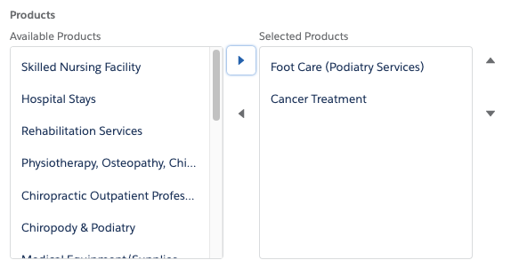

# A-HLS Dual Pick List Documentation

## Overview

This custom LWC renders a Dual PickList of values that are contained in a node within the Omniscript. This provides an alternative UI element to the normal multi-select.  

Examples of creating data to populate the Dual PickList choices for this custom LWC include the following:

- SetValues statement
- DataRaptor
- Integration Procedure (including obtaining data from another system via API)

The result is a UI component displaying choices on the left and selected items on the right. Shown below is screenshot of the sfiArch_DualPickList used in an Omniscript.

As the user selects picklist value(s) and moves the to the right, the OmniScript Data JSON is updated accordingly reflecting the selection.

At its core, this component uses the Salesforce [lightning-dual-listbox LWC](https://developer.salesforce.com/docs/component-library/bundle/lightning-dual-listbox/example). Refer to the lightning-dual-listbox documentation for more details. 

* * *

### **OmniScript Demo/DuelPickList**

This OS shows how to use the DuelPickList LWC. 
