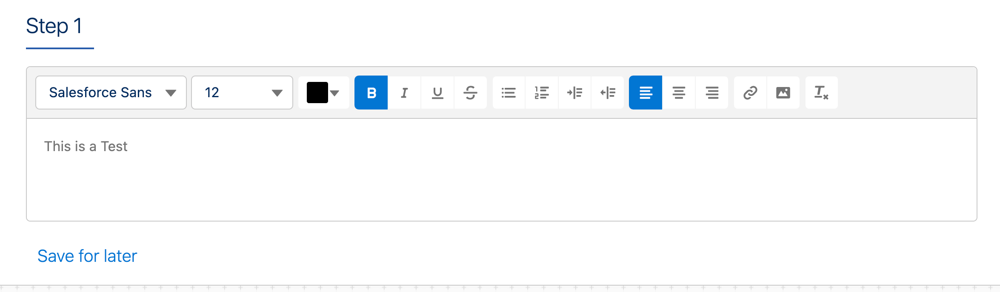
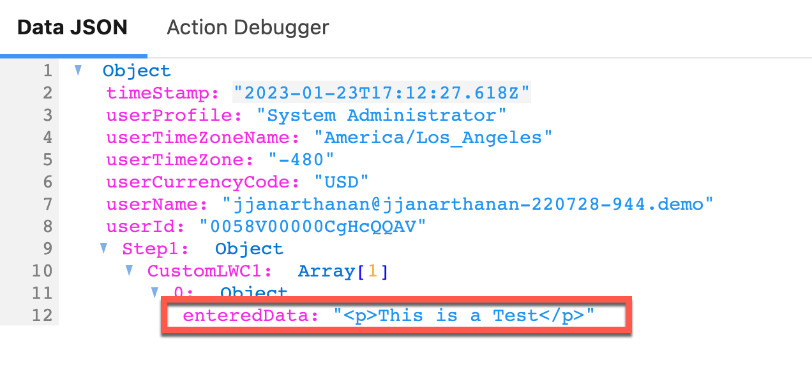

# A-HLS Rich Text Field LWC Documentation

## Overview

This custom LWC support the entry and display of Rich Text data.  The data copied can be saved into a Salesforce Rich Text field, retaining all formatting captured in this control. At its core, this component uses the Salesforce [lightning-input-rich-text](https://developer.salesforce.com/docs/component-library/bundle/lightning-input-rich-text/documentation). Refer to the lightning-input-rich-text documentation for more details. 

* * *

### **OmniScript Demo/RichText**

This OS shows how to use the Rich Text LWC. If you set the value "richtextvalue" , that will show up on LWC, what ever that get typed on the LWC will be set toe "enteredData"

