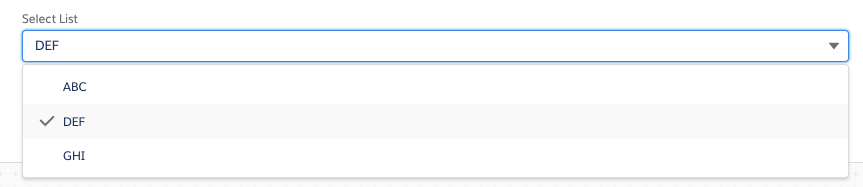

# A-HLS Set Value (Combobox) Documentation

https://confluence.internal.salesforce.com/display/INDUSTRYARCH/LWC+-+DR%2C+IP+or+SetValue+sourced+Single+Select+%28drop+down%29+LWC

## Overview

This custom LWC renders a dropdown, picklist of values that are contained in a node within the Omniscript. This provides flexibility in how picklist values are derived.   

Examples of creating data to populate picklist choices for this custom LWC include the following:

- SetValues statement
- DataRaptor
- Integration Procedure (including obtaining data from another system via API)

The standard Omniscript element type of Select, only supports populating the picklist choices from one of the following:

- sObject picklist
- static (manually entered) list of values
- custom Apex class

The result is a dropdown that is visually similar to the Omniscript Select element. Shown below is screenshot of the sfiArch_ComboBox used in an Omniscript

* * *

* * *

## Package

### **OmniScript Demo\Combobox**

The above OS shows how to set the values for the drop down field. At its core, this component uses the Salesforce [lightning-combobox LWC](https://developer.salesforce.com/docs/component-library/bundle/lightning-combobox/example). Refer to the lightning-combobox documentation for more details. 
