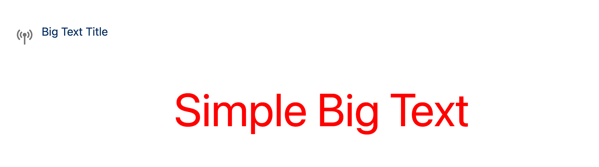
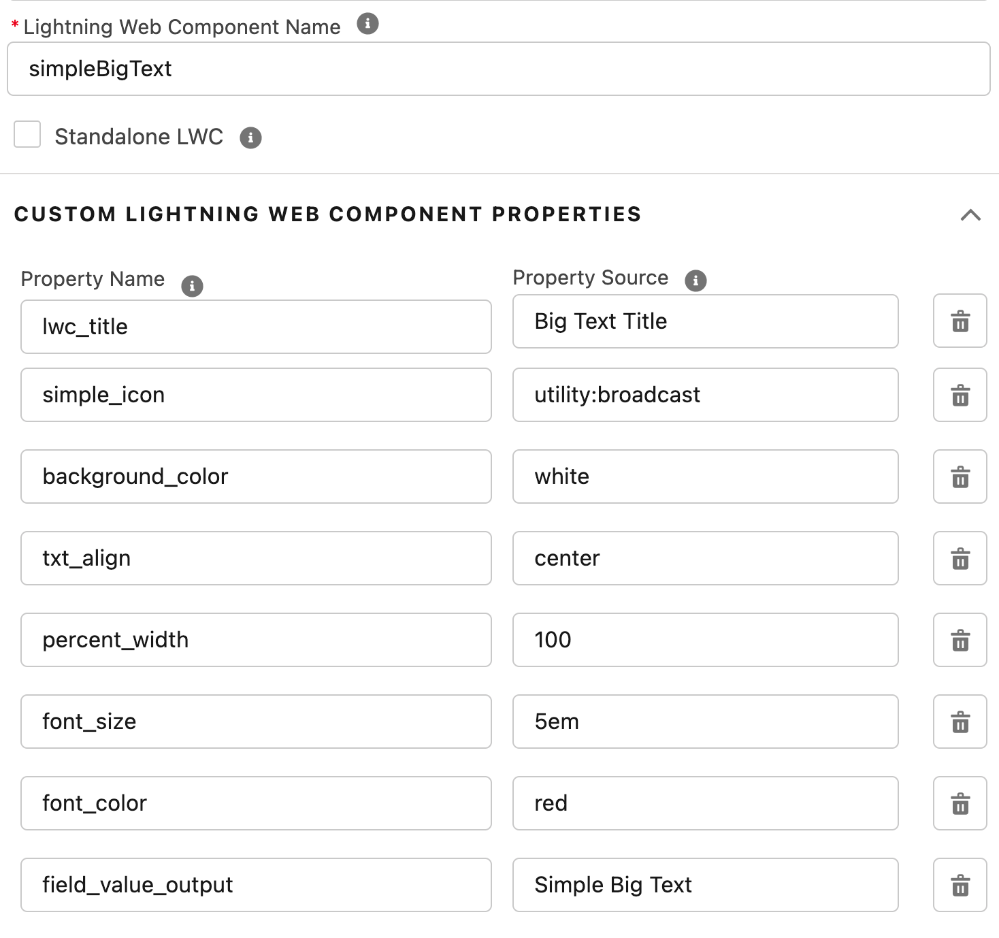

# A-HLS Simple Big Text Documentation

## Overview

Displays a field of information, with optional formatting.  LWC Configuration includes:

- LWC Title and Icon

- Help Text

- Background Color

- Field alignment in the LWC space

- Percentage of space used by LWC

- CSS Value for font size

- CSS Value for font color

  

  




```
property name="lwc_title" type="String" label="Title" default="Simple Big Text" description="Title of the component when displayed on the record page"

property name="simple_icon" type="String" label="Icon Reference" default="utility:broadcast" description="Icon identifier for this component"

property name="background_color" type="String" label="Background Color" default="white" description="Color to be used for the background of the space. Enter a simple CSS color name or a hex value.

property name="txt_align" type="String" datasource="left,right,center" default="center" label="Alignment of the text in the available space.

property name="percent_width" type="Integer" default="100" max="100" min="0" label="Percent width" description="Percentage of the available space the image should fill.

property name="font_size" type="String" default="1em" label="CSS value describing the desired font size"

property name="font_color" type="String" default="black" label="CSS value for the font color" />
```

 

* * * *


### **OmniScript Demo/SimpleBigText**

* The above OS shows how to use the LWC
