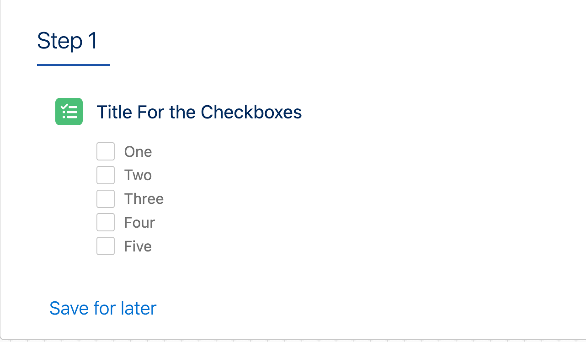
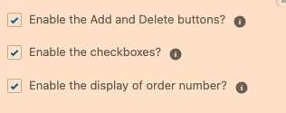

# A-HLS Simple Checklist Documentation

## Overview

When installed, creates a custom field called “Checklist_String__c” on major objects (Account, Contact, Opportunity, and Case).  Also includes several Custom Labels for translation of buttons and labels. 
This LWC provides the following functionality:

- Add a checklist to any page (Checklist_String__c needs to be added to any additional objects beyond those listed above). 

- Check list items can be added within the LWC

- Checklist items can be marked complete

- Checklist items can be deleted

- Optionally:

- - Hide the numbering
  
  - Hide the check boxes
  
  - Hide the add/remove buttons
  
    

* * *

### **OmniScript Demo/SimpleCheckList**

The above OS shows how to use the Simple Check List LWC

