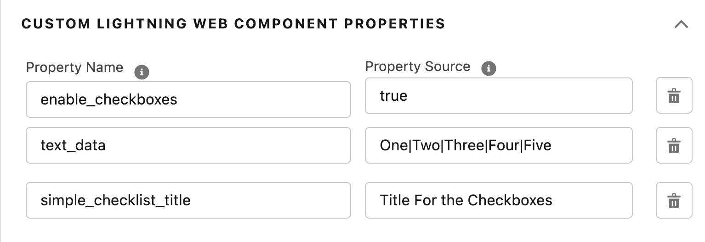

# A-HLS Simple Checklist Documentation

## Overview

When installed, creates a custom field called “Checklist_String__c” on major objects (Account, Contact, Opportunity, and Case).  Also includes several Custom Labels for translation of buttons and labels. 
This LWC provides the following functionality:

- Add a checklist to any page (Checklist_String__c needs to be added to any additional objects beyond those listed above). 

- Check list items can be added within the LWC

- Checklist items can be marked complete

- Checklist items can be deleted

- Optionally:

- - Hide the numbering
  
  - Hide the check boxes
  
  - Hide the add/remove buttons
  
    


```
<property name="enableAdd" type="Boolean" default="true" label="Enable the Add and Delete buttons?" description="Checking this will allow Users to add and remove checklist items.  Unchecking this will remove that ability, but will still allow interaction with the checklist items." />
<property name="enableCheckboxes" type="Boolean" default="true" label="Enable the checkboxes?" description="Checking this will allow Users to use the checkboxes to mark an item completed.  Unchecking this will remove that ability." />
<property name="enableSequenceNumbers" type="Boolean" default="true" label="Enable the display of order number?" description="Checking this will allow Users to see where the sort number for their Tasks.  Unchecking this will remove that display." />
```



* * *

### **OmniScript Demo/SimpleCheckList**

The above OS shows how to use the Simple Check List LWC

