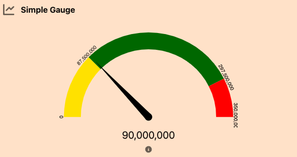
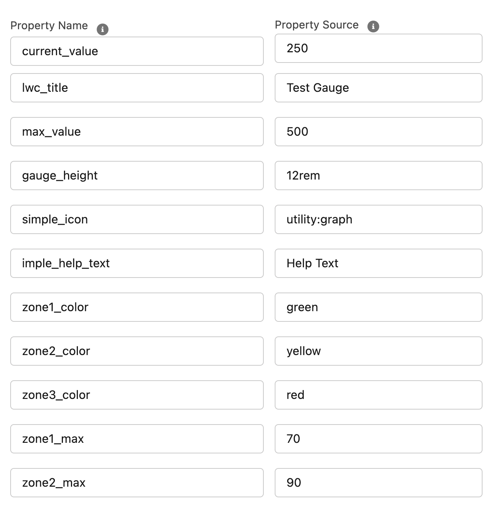

# A-HLS Simple Gauge Documentation

## Overview

Displays a Gauge chart based on two fields on the record the LWC is place on - one for the current value, and one for the max value.  Leverages Gauge JS that is based on Chart.js code.  LWC Configuration includes:

- Set the size of the three zones (two directly, one for what is left)
- Define Zone color
- Define help text, LWC title, and LWC Icon
- Set the height of the LWC




```
<property name="LWCTitle" type="String" label="Title" default="Simple Gauge" description="Title of the component when displayed on the record page" />
<property name="gaugeHeight" type="String" label="Graph Height" default="13rem" description="Enter the height of the gauge in CSS acceptable units" />
<property name="simpleIcon" type="String" label="Icon Reference" default="utility:graph" description="Icon identifier for this component" />
<property name="simpleHelpText" type="String" label="Help Text" description="The text that shows in the help icon on the component "/>
<property name="currentValueField" type="String" label="API Name of the field containing the current value" />
<property name="maxValueField" type="String" label="API Name of the field containing the max value" />
<property name="zone1Color" type="String" default="yellow" label="CSS Color definition for the first zone" />
<property name="zone1Max" type="Integer" default="25" label="Percentage of chart max to end Zone 1" />
<property name="zone2Color" type="String" default="#30B32D" label="CSS Color definition for the second zone" />
<property name="zone2Max" type="Integer" default="75" label="Percentage of chart max to end Zone 2" />
<property name="zone3Color" type="String" default="red" label="CSS Color definition for the third zone" />
```





* * *

### OmniScript Demo/SimpleGaugeSample

The above OS shws how the Gauge is used

* * *

## Configuration Requirements

### Pre-Install Configuration Steps:

Make sure the static resource found at https://github.com/healthcare-and-life-sciences/lwc/tree/main/src/staticresources 
