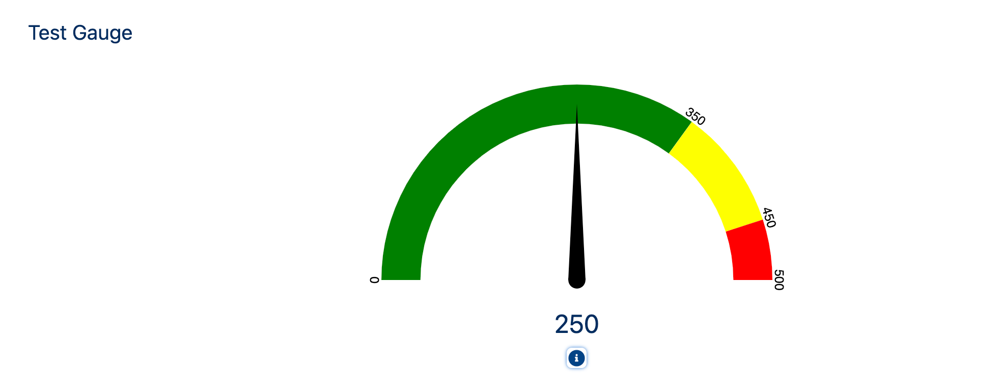

# A-HLS Simple Gauge Documentation

## Overview

Displays a Gauge chart based on two fields on the record the LWC is place on - one for the current value, and one for the max value.  Leverages Gauge JS that is based on Chart.js code.  LWC Configuration includes:

- Set the size of the three zones (two directly, one for what is left)
- Define Zone color
- Define help text, LWC title, and LWC Icon
- Set the height of the LWC

* * *

### **OmniScript Demo/SimpleGaugeSample

The above OS shws how the Gauge is used

* * *

## Configuration Requirements

### Pre-Install Configuration Steps:

Make sure the static resource 
