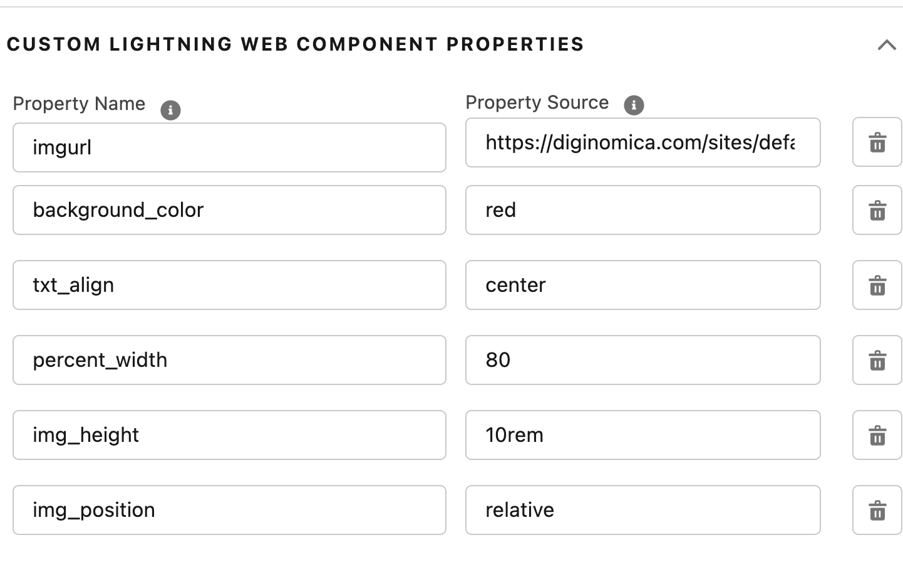

# A-HLS Simple Image Display Documentation

## Overview

Displays an image based on a URL provided.  LWC Configuration includes:

- URL for the image
- Background Color
- Alignment of the image in the space provided
- Definition (%) of the width used for the image
- CSS position definition relative to the LWC placement
- Z-Index of the image (For placement on top of or behind other page elements)

* * *

## Business Objective

Add Accelerator Objective

## Business Value and Benefits

* Add
* Add

* Add
* Add

* * *

## Industry Focus and Workflow

### Primary Industry:

* Add
* Add

### Primary User Persona:

* Add
* Add

### User Workflow:

* Add
* Add

* * *

## Package Includes:

### **OmniScript (#)**

* Add
* Add
* Add

### **DataRaptor (#)**

* Add
* Add
* Add

### **Custom Components (#)**

* Add
* Add
* Add

* * *

## Configuration Requirements

### Pre-Install Configuration Steps:

1. Add
2. Add

#### Install the Data Pack

1. The Data Pack folder in the following GitHub repository contains one (1) DPA Data Pack. Please download the Data Pack and save them to your desktop: **[INSERT GITHUB REPO LINK]**
2. Then, complete the following steps to import them into your Salesforce org.
    1. To Import, in your destination Salesforce org, Click on **App Launcher** → Search for '**OmniStudio DataPacks**' and click on it.
    2. Click on '**Installed**' and on the right side click on '**Import from**'.
    3. Select '**From File**' - When the window opens, select the Data Pack file that you downloaded and stored on your machine. Click '**Install**'.
3. More about DataRaptors: https://trailhead.salesforce.com/content/learn/modules/omnistudio-dataraptors

### Post-Install Configuration Steps:

1. Add
2. Add

* * *

## Assumptions

1. Add
2. Add

* * *

## Revision History

* **Revision Short Description (Month Day, Year)**

    * Add
    * Add

* * *

## Internal Only Information

* Accelerate HLS Website Link:
* Accelerator Info:
    * Vidyard Link:
    * YouTube Link:
    * Picture:
    *  GitHub Repo:

