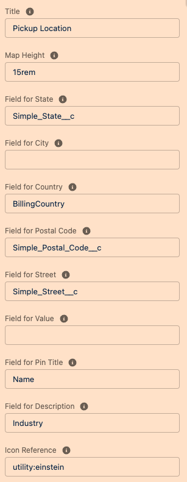

# A-HLS Simple Map Documentation

## Overview

Displays a Google Map based on fields identified on the record.  Component settings allow the definition of:

- Map Height

- Fields for each location data point

- Pin Title

- Pin Description

- LWC Title and Icon

  


```
<property name="LWCTitle" type="String" label="Title" description="Title of the component when displayed on the record page" />
<property name="mapHeight" type="String" label="Map Height" description="Enter the height of the map in CSS acceptable units" />
<property name="simpleState" type="String" label="Field for State" description="API Name for the field on this record that holds the State for this location" />
<property name="simpleCity" type="String" label="Field for City" description="API Name of the field on this record that holds the City for this location" />
<property name="simpleCountry" type="String" label="Field for Country" description="API Name of the field on this record that holds the Country for this location" />
<property name="simplePostalCode" type="String" label="Field for Postal Code" description="API Name for the field on this record that holds the Postal Code for this location" />
<property name="simpleStreet" type="String" label="Field for Street" description="API Name for the field on this record that holds the Street for this location" />
<property name="simpleValue" type="String" label="Field for Value" description="API Name for the field on this record that holds the Value for this location" />
<property name="simpleTitle" type="String" label="Field for Pin Title" description="API Name for the field on this record that holds the Title for this location" />
<property name="simpleDescr" type="String" label="Field for Description" description="API Name for the field on this record that holds the Description for this location" />
<property name="simpleIcon" type="String" label="Icon Reference" default="standard:account" description="Icon identifier for this map pin" />
```




* * *

## Package Includes:

### **OmniScript Demo/SimpleMapDisplay**

The above Omniscirpt shows how to use the map LWC

