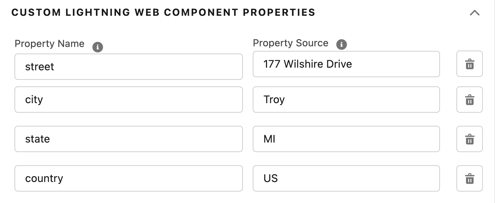

# A-HLS Simple Map Documentation

## Overview

Displays a Google Map based on fields identified on the record.  Component settings allow the definition of:

- Map Height

- Fields for each location data point

- Pin Title

- Pin Description

- LWC Title and Icon

  

* * *

## Package Includes:

### **OmniScript Demo/SimpleMapDisplay**

The above Omniscirpt shows how to use the map LWC

